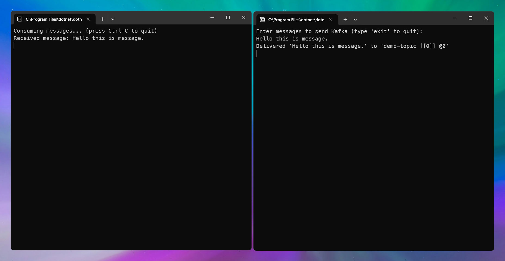

# Apache Kafka Demo with Dotnet8

This repository contains simple producer and consumer projects that using Kafka, written in .NET8

# Prerequisites / Steps

### Install Docker via winget

```sh
  winget install -e -i Docker.DockerDesktop
``` 

or download via [website]("https://www.docker.com/products/docker-desktop/")

### Run Docker Compose File (compose file at root of Solution folder)

```sh
  docker-compose up -d
```

### Create Kafka Topic

```sh
  docker exec -it kafka kafka-topics.sh --create --topic demo-topic --bootstrap-server localhost:9092 --partitions 1 --replication-factor 1
```

### Run Producer/Consumer Projects

**Linux/macOS**

**make .sh file executable**: ```chmod +x run-all.sh```

```sh
  ./run-all.sh
```

**Windows**

```sh
  ./run-all.bat
```

### Screenshot

